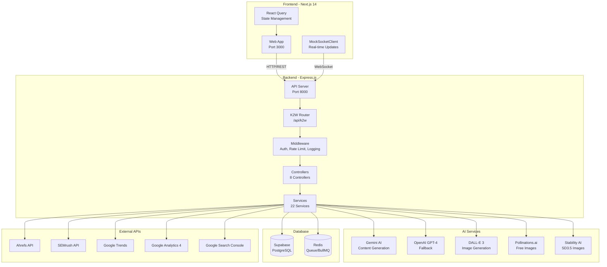
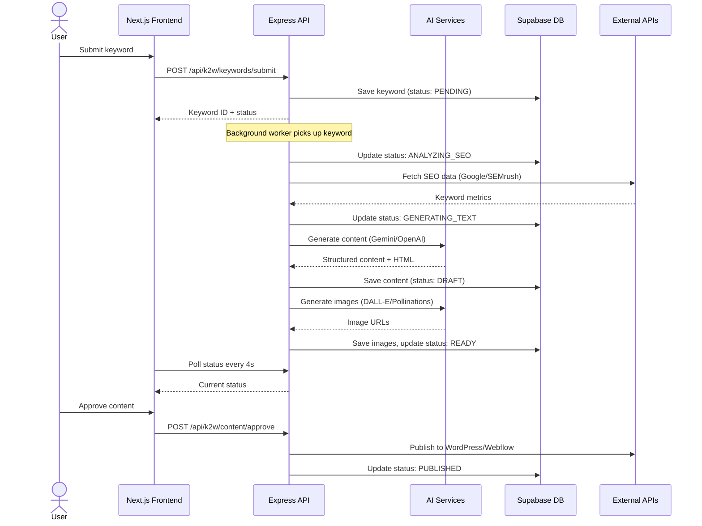
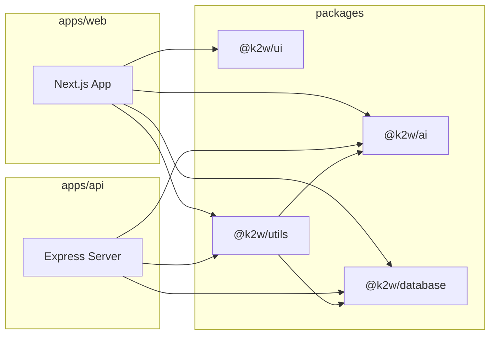
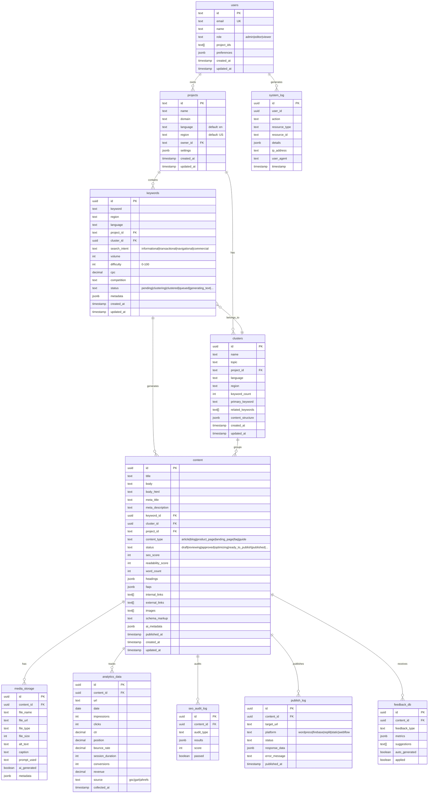
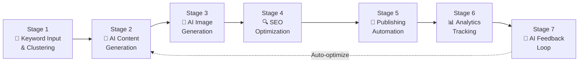

# K2W SYSTEM - TÀI LIỆU PHÂN TÍCH TOÀN DIỆN

> **Version:** 1.0.0 | **Ngày phân tích:** 14/06/2026 | **Trạng thái:** Đang chạy OK ✅

---

## MỤC LỤC

1. [Tổng Quan Dự Án](#1-tổng-quan-dự-án)
2. [Cấu Trúc Thư Mục](#2-cấu-trúc-thư-mục)
3. [Kiến Trúc Tổng Thể](#3-kiến-trúc-tổng-thể)
4. [Packages Chi Tiết](#4-packages-chi-tiết)
   - [@k2w/ai - AI Service Integration](#k2wai)
   - [@k2w/database - Database Layer](#k2wdatabase)
   - [@k2w/ui - Shared UI Components](#k2wui)
   - [@k2w/utils - Shared Utilities](#k2wutils)
5. [Backend (apps/api) Chi Tiết](#5-backend-appsapi)
6. [Frontend (apps/web) Chi Tiết](#6-frontend-appsweb)
7. [Database Schema](#7-database-schema)
8. [K2W Workflow Pipeline](#8-k2w-workflow-pipeline)
9. [API Endpoints](#9-api-endpoints)
10. [Công Nghệ & Dependencies](#10-công-nghệ--dependencies)

---

## 1. TỔNG QUAN DỰ ÁN

**K2W System** (Keyword-to-Website) là hệ thống AI-driven tự động biến đổi từ khóa thành website hoàn chỉnh với nội dung SEO-optimized. Hệ thống sử dụng kiến trúc **Monorepo** với **pnpm workspaces** và **Turborepo** để quản lý.

### Mục Tiêu Chính

- 🤖 **Tự động sinh nội dung AI** từ keyword sang bài viết chuẩn SEO
- 🎨 **Tự động tạo ảnh AI** minh họa cho nội dung
- 🌍 **Hỗ trợ đa ngôn ngữ** (Anh, Việt, Trung, Nhật, Hàn, Pháp, Đức, Tây Ban Nha...)
- 📊 **Phân tích SEO** từ nhiều nguồn (Google, Ahrefs, SEMrush)
- 🚀 **Publish đa nền tảng** (WordPress, Webflow, Firebase, Static)
- 📈 **Analytics & A/B Testing** để tối ưu hiệu suất
- 💰 **Cost Optimization** - Quản lý chi phí AI token

---

## 2. CẤU TRÚC THƯ MỤC

```
K2W-system/
├── apps/
│   ├── api/                          # Backend Express.js server
│   │   ├── src/
│   │   │   ├── index.ts              # Entry point (dev server)
│   │   │   ├── index-optimized.ts    # Optimized entry point
│   │   │   ├── production-server.ts  # Production server (BullMQ + Socket.io)
│   │   │   ├── check_db.ts           # DB verification utility
│   │   │   ├── common/               # Shared interfaces, response handler
│   │   │   ├── controllers/          # 8 controllers
│   │   │   ├── dto/                  # Data Transfer Objects
│   │   │   ├── middleware/           # Auth, rate-limit, logging, etc.
│   │   │   ├── repositories/         # Database repositories
│   │   │   ├── routes/               # 6 route files
│   │   │   ├── services/             # 22 services
│   │   │   └── types/                # 5 type definition files
│   │   └── package.json
│   │
│   └── web/                          # Next.js 14 frontend
│       ├── src/
│       │   ├── app/                  # App Router pages
│       │   │   ├── page.tsx          # Home page (keyword submission)
│       │   │   ├── dashboard/        # Dashboard pages
│       │   │   ├── admin/            # Admin panel
│       │   │   └── multi-site/       # Multi-site management
│       │   ├── components/           # ~25+ components
│       │   ├── hooks/                # 50+ React Query hooks
│       │   ├── lib/                  # API client, socket, utils
│       │   ├── providers/            # React Query provider
│       │   └── types/                # 8 type files
│       └── package.json
│
├── packages/
│   ├── ai/                           # @k2w/ai - AI integrations
│   │   └── src/
│   │       ├── gemini.ts             # Gemini AI (default, free)
│   │       ├── openai.ts             # OpenAI GPT-4 (fallback)
│   │       ├── imagen.ts             # Google Imagen 3
│   │       ├── pollinations.ts       # Pollinations.ai (free images)
│   │       ├── stability.ts          # Stability AI (SD3.5)
│   │       ├── huggingface.ts        # Hugging Face (free images)
│   │       ├── prompts.ts            # Prompt templates
│   │       └── index.ts              # Barrel exports
│   │
│   ├── database/                     # @k2w/database - DB layer
│   │   ├── migrations/
│   │   │   └── 001_initial_schema.sql  # Full DB schema
│   │   └── src/
│   │       ├── client.ts             # Supabase client
│   │       ├── advanced-pool.ts      # Connection pool & caching
│   │       ├── schemas.ts            # Zod validation schemas
│   │       ├── k2w-schemas.ts        # K2W table schemas & constants
│   │       ├── k2w-service.ts        # K2W CRUD service
│   │       ├── migration-runner.ts   # SQL migration runner
│   │       ├── constants.ts          # Status/language constants
│   │       └── types.ts              # Database type definitions
│   │
│   ├── ui/                           # @k2w/ui - Shared UI
│   │   └── src/
│   │       ├── components/           # 10 shadcn/ui components
│   │       └── lib/utils.ts          # cn() utility
│   │
│   └── utils/                        # @k2w/utils - Utilities
│       └── src/
│           ├── index.ts              # String/date utilities
│           ├── validation.ts         # Input validation
│           ├── workflow.ts           # Workflow type definitions
│           ├── k2w-ai.ts             # AI service helpers
│           └── k2w-workflow.ts       # Workflow engine
│
├── docs/                             # 15+ documentation files
├── package.json                      # Root workspace config
├── pnpm-workspace.yaml               # pnpm workspace definition
├── turbo.json                        # Turborepo build config
└── COMPLETION_SUMMARY.md             # Feature completion status
```

---

## 3. KIẾN TRÚC TỔNG THỂ

### 3.1 Kiến Trúc Hệ Thống (System Architecture)



### 3.2 Data Flow (Luồng Dữ Liệu)



### 3.3 Package Dependency Graph



---

## 4. PACKAGES CHI TIẾT

### @k2w/ai

**Mục đích:** Tích hợp các dịch vụ AI cho sinh nội dung và hình ảnh.

| Service | Model | Chi phí | Chức năng |
|---------|-------|---------|-----------|
| `GeminiService` | Gemini 3.5 Flash | **Free** (15 RPM) | Sinh nội dung văn bản (default) |
| `OpenAIService` | GPT-4 Turbo | Trả phí | Sinh nội dung văn bản (fallback) + DALL-E 3 ảnh |
| `ImagenService` | Google Imagen 3 | Trả phí | Sinh ảnh chất lượng cao |
| `PollinationsService` | Flux/SDXL/Turbo | **100% Free** | Sinh ảnh không giới hạn |
| `StabilityAIService` | SD 3.5 Large | Free (25 ảnh/ngày) | Sinh ảnh chuyên nghiệp |
| `HuggingFaceService` | FLUX.1/SDXL | **Free** (1000 req/h) | Sinh ảnh miễn phí |

**Cấu trúc dữ liệu Content Generation:**

```typescript
// Input
ContentGenerationInput {
  keyword: string;           // Từ khóa chính
  language: string;          // Ngôn ngữ (en, vi, zh, ja...)
  region: string;            // Khu vực (US, VN, JP...)
  wordCount: number;         // Số từ (300-3000, default 1000)
  contentType: 'article' | 'product_page' | 'landing_page';
  targetAudience?: string;   // Đối tượng mục tiêu
  tone: 'professional' | 'casual' | 'technical' | 'friendly';
  customPrompt?: string;     // Prompt tùy chỉnh
}

// Output
ContentGenerationOutput {
  title: string;             // Tiêu đề bài viết
  metaTitle: string;         // Meta title (≤60 ký tự)
  metaDescription: string;   // Meta description (≤160 ký tự)
  body: string;              // Nội dung text
  htmlBody: string;          // Nội dung HTML
  headings: Array<{level: 1-6, text: string}>;
  faqs: Array<{question, answer}>;
  cta: string;               // Call-to-action
  readabilityScore: number;  // Điểm readability (0-100)
  seoScore: number;          // Điểm SEO (0-100)
}
```

**Prompt Templates (`K2WPromptTemplates`):**
- `getContentGenerationPrompt()` - Template sinh nội dung SEO
- `getImageGenerationPrompt()` - Template sinh ảnh
- `getTranslationPrompt()` - Template dịch thuật

---

### @k2w/database

**Mục đích:** Layer database với Supabase PostgreSQL.

**Các thành phần chính:**

| File | Chức năng |
|------|-----------|
| `client.ts` | Khởi tạo Supabase client (anon + admin/service role) |
| `advanced-pool.ts` | Connection pool thông minh với caching queries |
| `schemas.ts` | Zod validation schemas cho tất cả các bảng |
| `k2w-schemas.ts` | Định nghĩa TABLE_NAMES, STATUS constants, K2W interfaces |
| `k2w-service.ts` | K2WDatabaseService - CRUD cho 11 bảng |
| `migration-runner.ts` | Chạy SQL migrations tự động |
| `constants.ts` | Hằng số: ngôn ngữ, khu vực, content types, search intent |
| `types.ts` | TypeScript types cho Database schema |

**DatabaseService CRUD Operations:**
- `findById<T>(table, id)` - Tìm theo ID
- `query<T>(table, filters, options)` - Query với filter, sort, pagination
- `create<T>(table, data)` - Tạo mới record
- `update<T>(table, id, data)` - Cập nhật record
- `delete(table, id)` - Xóa record
- `bulkCreate<T>(table, data)` - Tạo hàng loạt

**K2WDatabaseService (extends DatabaseService):**
- User Management: `createUser`, `getUserById`, `updateUser`
- Project Management: `createProject`, `getProjectById`, `getProjectsByUser`
- Keyword Management: `createKeyword`, `getKeywordsByProjectId`, `bulkUpdateKeywordStatus`
- Cluster Management: `createCluster`, `getClustersByProjectId`
- Content Management: `createContent`, `getContentByProjectId`, `searchContent`
- Analytics, Media, SEO Audit, Publish Log, Feedback

---

### @k2w/ui

**Mục đích:** Shared UI components dựa trên shadcn/ui + Tailwind CSS.

**10 Components:**

| Component | Mô tả |
|-----------|-------|
| `Button` | Nút với variants (default, destructive, outline, ghost, link) |
| `Input` | Ô nhập liệu |
| `Card` | Card container với CardHeader, CardContent, CardFooter |
| `Badge` | Huy hiệu trạng thái với variants |
| `Avatar` | Avatar với fallback text |
| `Alert` | Thông báo với variants (default, destructive) |
| `Label` | Nhãn form |
| `Progress` | Thanh tiến trình |
| `Separator` | Đường phân cách |
| `Select` | Dropdown chọn |

**Utility:** `cn()` - Kết hợp `clsx` + `tailwind-merge`

---

### @k2w/utils

**Mục đích:** Các utility functions và workflow engine.

**String Utilities:**
- `slugify(text)` - Chuyển text thành slug URL
- `truncate(text, length)` - Cắt ngắn text
- `capitalize(text)` - Viết hoa chữ đầu
- `extractKeywords(text)` - Trích xuất từ khóa từ text
- `formatDate(date)` - Format ngày tháng
- `timeAgo(date)` - Hiển thị "X phút trước"

**Validation (validateKeyword, validateLanguage, validateRegion...):**
- Hỗ trợ 7 ngôn ngữ: en, vi, zh, ja, es, fr, de
- Hỗ trợ 9 khu vực: US, VN, CN, JP, ES, FR, DE, GB, AU

**Workflow Types (`workflow.ts`):**
- 7 stage definitions: KEYWORD_INPUT → CONTENT_GENERATION → IMAGE_GENERATION → SEO_OPTIMIZATION → PUBLISHING → ANALYTICS_TRACKING → FEEDBACK_LOOP
- WorkflowContext với tracking trạng thái, lỗi, retry
- Automation triggers: manual, scheduled, event, API
- Notification config: email, telegram, slack
- Human-in-loop approval gates
- Quality thresholds cho content, SEO, performance

**Workflow Engine (`k2w-workflow.ts`):**
- `KeywordClusteringStage` - Validate, deduplicate, cluster keywords
- Phát hiện search intent: informational, transactional, navigational, commercial
- Clustering theo topic similarity

---

## 5. BACKEND (apps/api)

### 5.1 Entry Points

| File | Mục đích | Port |
|------|----------|------|
| `src/index.ts` | Development server với health check + background queue worker | 8000 |
| `src/index-optimized.ts` | Optimized server với caching, performance monitoring | 8000 |
| `src/production-server.ts` | Production server với BullMQ queue + Socket.io real-time | 8000 |

### 5.2 Controllers (8 files)

| Controller | Chức năng chính |
|------------|-----------------|
| `optimized-k2w.controller.ts` | Keyword CRUD, Content CRUD, Analytics, Workflow |
| `aiController.ts` | AI content generation, image generation, SEO, translation |
| `analyticsController.ts` | Analytics data, optimization, reports, benchmarks |
| `abTestingController.ts` | A/B test lifecycle, variant generation, auto-optimize |
| `advancedAnalyticsController.ts` | GA4/GSC integration, alerts, actionable insights |
| `costOptimizationController.ts` | Token tracking, budget management, prompt optimization |
| `externalSeoController.ts` | Ahrefs/SEMrush/Google Trends integration |
| `k2w-workflow.controller.ts` | Full K2W pipeline, translation, publishing |

### 5.3 Services (22 files)

#### Core Services:
| Service | Chức năng |
|---------|-----------|
| `keyword.service.ts` | Import, validate, cluster, paginate keywords |
| `content.service.ts` | AI content gen, optimization, image gen, batch operations |
| `analytics.service.ts` | Dashboard, keyword/content/system analytics |
| `ai.service.ts` | Gemini/OpenAI integration, content + image generation |
| `cache.service.ts` | In-memory caching với TTL, tag-based invalidation |

#### Advanced Services:
| Service | Chức năng |
|---------|-----------|
| `k2w-unified.service.ts` | **7-stage K2W pipeline orchestration** |
| `ai-content-generator.service.ts` | Gemini-powered content with JSON parsing |
| `ai-image-generator.service.ts` | DALL-E 3 + bulk image generation |
| `ai-translation.service.ts` | DeepL translation, 29+ languages |
| `publishing-automation.service.ts` | Multi-platform publishing (WordPress, Shopify, Firebase) |
| `ab-testing.service.ts` | A/B test lifecycle + statistical significance |
| `advanced-analytics.service.ts` | GA4 + Search Console + alerts |
| `external-seo-api.service.ts` | Ahrefs + SEMrush + Google Trends |
| `cost-optimization.service.ts` | Token tracking, budget management, alerts |
| `webhook-notifier.service.ts` | Slack notifications for review events |
| `socket.service.ts` | Socket.io real-time workflow updates |
| `bullmq.service.ts` | BullMQ job queue management |

### 5.4 Middleware (7 files)

| Middleware | Chức năng |
|------------|-----------|
| `error-handler.middleware.ts` | Global error handling + async wrapper |
| `auth.middleware.ts` | JWT authentication via Supabase |
| `rate-limiter.middleware.ts` | Basic rate limiting (100 req/60s) |
| `advanced-rate-limiter.middleware.ts` | Adaptive: Free (10/min), Pro (50/min), Enterprise (200/min) |
| `request-logger.middleware.ts` | Request/response logging |
| `optimization-integration.middleware.ts` | Smart caching + performance monitoring |
| `controller-error-handler.middleware.ts` | Controller-level error handling |

### 5.5 Routes (6 files)

| Router | Base Path | Endpoints |
|--------|-----------|-----------|
| `k2w.router.ts` | `/api/k2w` | Keywords, Content, Analytics, Workflow, System |
| `optimized-k2w.router.ts` | `/api/k2w` | Optimized versions of above |
| `ab-testing.router.ts` | `/api/k2w/ab-testing` | 8 endpoints |
| `advanced-analytics.router.ts` | `/api/k2w/analytics-advanced` | 7 endpoints |
| `cost-optimization.router.ts` | `/api/k2w/cost-optimization` | 7 endpoints |
| `external-seo.router.ts` | `/api/k2w/seo-external` | 7 endpoints |

### 5.6 Common Utilities

| File | Chức năng |
|------|-----------|
| `response.handler.ts` | `ResponseHandler` class: success, created, badRequest, unauthorized, notFound, internalError... |
| `interfaces.ts` | Shared interfaces: PaginationOptions, FilterOptions, ApiResponse |

---

## 6. FRONTEND (apps/web)

### 6.1 Công Nghệ

- **Framework:** Next.js 14.2 (App Router)
- **State Management:** TanStack React Query 5.90
- **Styling:** Tailwind CSS 3 + Glassmorphism
- **Validation:** Zod 3.22
- **HTTP Client:** Axios 1.6
- **Icons:** Lucide React 0.400
- **Notifications:** Sonner 1.4

### 6.2 Pages & Routing

```
/                           # Home - Keyword submission form + history
/dashboard                  # Dashboard overview - 6 feature cards + quick stats
/dashboard/advanced         # Advanced dashboard - real-time metrics, budget
/dashboard/seo-tools        # SEO tools - keyword research, competitors
/dashboard/ab-testing       # A/B testing manager
/dashboard/cost-optimization # Cost optimization - budget management
/dashboard/content-tools    # Content tools - images, translation, publishing
/dashboard/approval         # Editorial approval workflow
/admin                      # Admin panel - system health, users, APIs
/multi-site                 # Multi-site management - domains, deployments
```

### 6.3 Components (25+ components)

#### Layout:
- `PageHeader` - Global navbar với navigation, theme toggle

#### Keywords:
- `KeywordStatusBadge` - 7 trạng thái với màu sắc + icon
- `KeywordList` - Danh sách keywords với glassmorphism
- `KeywordSubmissionForm` - Form submit keyword

#### Dashboard:
- `StatsCard` / `MetricCard` - Card thống kê
- `QuickStats` - 6 metrics nhanh (progress, quality, speed, SEO, time)
- `RecentKeywords` - 5 keywords gần nhất

#### Approval Workflow:
- `ApprovalWorkflow` - Full editorial workflow
- `PendingList` - Danh sách chờ duyệt
- `DirectEditor` - HTML editor trực tiếp
- `LivePreview` - Live preview trong iframe
- `RejectionForm` - Form từ chối với feedback

#### Admin:
- `HealthCards` - System health monitoring
- `TabNavigation` - Tabs admin
- `RecentActivity` - Activity timeline
- `SystemPerformance` - Memory usage

#### Advanced:
- `AdvancedDashboard` - Metrics real-time, system health, budget
- `ExternalSEOTools` - Keyword research panel
- `ABTestingManager` - A/B test create/status/results
- `CostOptimization` - Budget management + alerts
- `ContentEnhancementTools` - Image gen, translation, publishing

#### Multi-site:
- `DomainOverview` - Domain management
- `DeploymentsList` - Deployment history
- `PerformanceAnalytics` - Site analytics

### 6.4 Hooks (50+ React Query Hooks)

**Tổ chức theo feature:**

| Feature | Hooks |
|---------|-------|
| Health | `useHealthCheck`, `useK2WHealthCheck` |
| Keywords | `useKeywordHistory`, `useKeywordStatus`, `useSubmitKeyword`, `useImportKeywords` |
| Content | `useContentBatches`, `useContentDetail`, `useGenerateContent`, `usePendingReviewContent`, `useApproveContent`, `useRejectContent`, `useUpdateContentBody` |
| Analytics | `useAnalytics`, `useRealTimeMetrics`, `useBudgetStatus` |
| Images | `useGenerateImage`, `useBatchGenerateImages`, `useImageStatus` |
| Translation | `useTranslateContent`, `useTranslationLanguages`, `useTranslationStatus` |
| Publishing | `usePublishContent`, `usePublishStatus` |
| A/B Testing | `useCreateABTest`, `useStartABTest`, `useABTestStatus`, `useABTestResults`, `useGenerateVariants` |
| Cost | `useBudgetStatus`, `useConfigureBudget`, `useCostAnalytics`, `useCostRecommendations` |
| SEO | `useExternalKeywordData`, `useKeywordSuggestions`, `useCompetitorAnalysis`, `useGoogleTrends` |

### 6.5 API Client

**`api-client.ts`:**
- Axios instance với base URL từ env
- Bearer token từ localStorage
- 401 handling tự động redirect /login

**`api-services.ts`:** 13 service modules mapping đến tất cả API endpoints

---

## 7. DATABASE SCHEMA

### 7.1 Entity Relationship Diagram



### 7.2 Status Flow

**Keyword Status Flow:**
```
PENDING → CLUSTERING → CLUSTERED → QUEUED → GENERATING_TEXT 
→ GENERATING_IMAGES → SEO_REVIEW → READY_TO_PUBLISH → PUBLISHED
↓ (any stage)
FAILED / ARCHIVED
```

**Content Status Flow:**
```
DRAFT → REVIEWING → APPROVED → OPTIMIZING → READY_TO_PUBLISH → PUBLISHED
↓                                              ↓
ARCHIVED                                    UPDATING
```

### 7.3 Database Views

- **`keywords_with_content`** - JOIN keywords với content để xem trạng thái đầy đủ
- **`content_with_analytics`** - JOIN content với analytics_data để xem metrics

---

## 8. K2W WORKFLOW PIPELINE

### 8.1 7-Stage Pipeline



### 8.2 Chi Tiết Từng Stage

| Stage | Đầu vào | Xử lý | Đầu ra |
|-------|---------|-------|--------|
| **1. Keyword Input** | Keywords thô (manual/CSV/Ahrefs/SEMrush) | Validate, deduplicate, detect search intent, cluster theo topic | Keywords đã phân cụm với intent |
| **2. Content Generation** | Keyword + cluster + language + region | Gemini/OpenAI sinh content theo template, JSON parsing | Title, body HTML, meta, headings, FAQs |
| **3. Image Generation** | Keyword + content context | DALL-E 3/Pollinations/Stability AI sinh ảnh | 1-3 ảnh minh họa |
| **4. SEO Optimization** | Content + keyword targets | Kiểm tra keyword density, readability, meta tags, heading structure | SEO score + recommendations |
| **5. Publishing** | Content đã approve | Deploy lên WordPress/Webflow/Firebase/Static | URL published |
| **6. Analytics Tracking** | Published URL | Collect GSC/GA4 data: impressions, clicks, CTR, position | Analytics metrics |
| **7. Feedback Loop** | Performance data | AI phân tích, đề xuất cải thiện, auto-optimize | Content updates + A/B tests |

### 8.3 Human-in-the-Loop

```
AI Generation → Editorial Review → Approve/Reject/Edit → Publish
                     ↑                                  |
                     └────── Feedback Loop ─────────────┘
```

---

## 9. API ENDPOINTS

### 9.1 Keywords (`/api/k2w/keywords`)

| Method | Endpoint | Mô tả |
|--------|----------|-------|
| `POST` | `/keywords/submit` | Submit 1 keyword |
| `GET` | `/keywords/:keyword_id/status` | Lấy trạng thái keyword |
| `GET` | `/keywords/history` | Lịch sử keywords (paginated) |
| `POST` | `/keywords/import` | Import batch keywords |
| `GET` | `/keywords/:project_id` | Keywords của project |
| `POST` | `/keywords/cluster` | Cluster thủ công |
| `PUT` | `/keywords/:keyword_id/status` | Cập nhật trạng thái |
| `DELETE` | `/keywords/:keyword_id` | Xóa keyword |

### 9.2 Content (`/api/k2w/content`)

| Method | Endpoint | Mô tả |
|--------|----------|-------|
| `POST` | `/content/generate` | Sinh nội dung AI |
| `GET` | `/content/pending-review` | Nội dung chờ duyệt |
| `POST` | `/content/:content_id/approve` | Duyệt nội dung |
| `POST` | `/content/:content_id/reject` | Từ chối + feedback |
| `PUT` | `/content/:content_id/body` | Sửa trực tiếp HTML |
| `GET` | `/content/:content_id` | Chi tiết nội dung |
| `GET` | `/content/batches` | Danh sách batches |
| `GET` | `/content/:content_id/download` | Tải nội dung (txt/docx/pdf) |
| `POST` | `/content/batch-generate` | Sinh hàng loạt |
| `GET` | `/content/project/:project_id` | Nội dung của project |
| `PUT` | `/content/:content_id/optimize` | Tối ưu nội dung |
| `DELETE` | `/content/:content_id` | Xóa nội dung |

### 9.3 Analytics (`/api/k2w/analytics`)

| Method | Endpoint | Mô tả |
|--------|----------|-------|
| `GET` | `/analytics/:project_id/dashboard` | Dashboard tổng quan |
| `GET` | `/analytics/detailed` | Phân tích chi tiết |
| `GET` | `/analytics/performance/:keyword_id` | Hiệu suất keyword |
| `GET` | `/analytics/:project_id/keywords` | Analytics theo keyword |
| `GET` | `/analytics/:project_id/content` | Analytics theo content |
| `GET` | `/analytics/system/overview` | System analytics |

### 9.4 A/B Testing (`/api/k2w/ab-testing`)

| Method | Endpoint | Mô tả |
|--------|----------|-------|
| `POST` | `/tests` | Tạo A/B test |
| `POST` | `/tests/:testId/start` | Bắt đầu test |
| `POST` | `/tests/:testId/stop` | Dừng test |
| `GET` | `/tests/:testId/status` | Trạng thái test |
| `GET` | `/tests/:testId/results` | Kết quả + statistical significance |
| `POST` | `/variants/generate` | AI sinh variants |
| `POST` | `/optimize/auto` | Tự động tối ưu |
| `POST` | `/optimize/batch` | Batch optimization |

### 9.5 Cost Optimization (`/api/k2w/cost-optimization`)

| Method | Endpoint | Mô tả |
|--------|----------|-------|
| `POST` | `/track-usage` | Track token usage |
| `POST` | `/optimize-prompt` | Tối ưu prompt giảm cost |
| `GET` | `/analytics` | Cost analytics |
| `GET` | `/recommendations` | Đề xuất tiết kiệm |
| `GET` | `/budget/status` | Trạng thái ngân sách |
| `PUT` | `/budget/config` | Cấu hình ngân sách |
| `POST` | `/batch-process` | Batch process tối ưu |

### 9.6 External SEO (`/api/k2w/seo-external`)

| Method | Endpoint | Mô tả |
|--------|----------|-------|
| `POST` | `/keyword-data` | Keyword data đa nguồn |
| `POST` | `/keyword-suggestions` | Gợi ý keywords |
| `POST` | `/competitor-analysis` | Phân tích đối thủ |
| `POST` | `/google-trends` | Google Trends data |
| `POST` | `/combine-metrics` | Kết hợp metrics |
| `POST` | `/batch-research` | Batch keyword research |
| `GET` | `/sources` | Danh sách nguồn SEO |

### 9.7 Advanced Analytics (`/api/k2w/analytics-advanced`)

| Method | Endpoint | Mô tả |
|--------|----------|-------|
| `POST` | `/analytics-data` | Analytics data |
| `POST` | `/performance-metrics` | Performance metrics |
| `POST` | `/actionable-insights` | AI insights |
| `POST` | `/analyze-trends` | Trend analysis |
| `GET` | `/alerts` | Active alerts |
| `POST` | `/alerts/:alert_id/resolve` | Resolve alert |
| `GET` | `/real-time` | Real-time data |

---

## 10. CÔNG NGHỆ & DEPENDENCIES

### 10.1 Backend Dependencies

| Package | Version | Mục đích |
|---------|---------|----------|
| express | 4.18.2 | Web framework |
| @supabase/supabase-js | 2.38.4 | Database client |
| openai | 4.20.1 | OpenAI API |
| @google/generative-ai | 0.24.1 | Gemini AI API |
| bull | 4.12.2 | Job queue |
| redis | 4.6.12 | Queue backend |
| sharp | 0.32.6 | Image processing |
| winston | 3.11.0 | Logging |
| zod | 3.22.4 | Schema validation |
| rate-limiter-flexible | 2.4.1 | Rate limiting |
| google-trends-api | 4.9.2 | Google Trends |
| axios | 1.6 | HTTP client |
| helmet | - | Security headers |
| cors | - | CORS |
| socket.io | - | Real-time WebSocket |

### 10.2 Frontend Dependencies

| Package | Version | Mục đích |
|---------|---------|----------|
| next | 14.2.0 | React framework |
| react | 18.2.0 | UI library |
| @tanstack/react-query | 5.90.2 | Server state management |
| tailwindcss | 3 | Utility CSS |
| zod | 3.22.4 | Validation |
| axios | 1.6 | HTTP client |
| lucide-react | 0.400 | Icons |
| sonner | 1.4 | Toast notifications |
| @supabase/supabase-js | 2.38.4 | Backend client |
| @google-cloud/pubsub | 4.0.7 | Event messaging |

### 10.3 Build Tools

| Tool | Mục đích |
|------|----------|
| pnpm | Package manager (workspaces) |
| turbo | Monorepo build orchestration |
| tsc / tsup | TypeScript compilation |
| prettier | Code formatting |

### 10.4 AI Services Comparison

| Service | Loại | Chi phí | Giới hạn |
|---------|------|--------|----------|
| **Gemini 3.5 Flash** | Text | Free | 15 RPM |
| **OpenAI GPT-4** | Text | ~$0.03/1K tokens | Pay-as-you-go |
| **DALL-E 3** | Image | ~$0.04/image | Pay-as-you-go |
| **Pollinations.ai** | Image | **100% Free** | Không giới hạn |
| **Stability AI** | Image | Free tier | 25 ảnh/ngày |
| **Hugging Face** | Image | **Free** | 1000 req/h |
| **Google Imagen 3** | Image | Trả phí | Pay-as-you-go |
| **DeepL** | Translation | Free tier | 500K chars/tháng |

---

## TÓM TẮT

K2W System là một **hệ thống tự động hóa SEO end-to-end** với các đặc điểm nổi bật:

1. ✅ **AI Content Generation** - Gemini + OpenAI GPT-4 cho text; 5 dịch vụ ảnh (3 free)
2. ✅ **SEO Automation** - Tích hợp Ahrefs, SEMrush, Google Trends, GSC, GA4
3. ✅ **Editorial Workflow** - Human-in-the-loop với approve/reject/edit + live preview
4. ✅ **A/B Testing** - Statistical significance + AI variant generation
5. ✅ **Cost Optimization** - Token tracking, budget alerts, prompt optimization
6. ✅ **Multi-platform Publishing** - WordPress, Webflow, Firebase, Static
7. ✅ **Multi-language** - 29+ ngôn ngữ qua DeepL
8. ✅ **Real-time Updates** - Socket.io + React Query polling
9. ✅ **Monorepo Architecture** - pnpm + Turborepo, 4 shared packages
10. ✅ **Enterprise Security** - JWT auth, rate limiting (3 tiers), Helmet, CORS

---

*Tài liệu được tạo tự động từ phân tích source code ngày 14/06/2026. Dự án đang chạy OK.*
